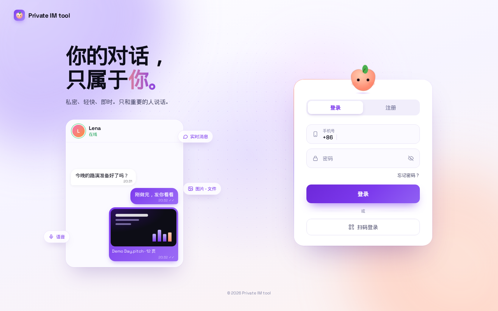
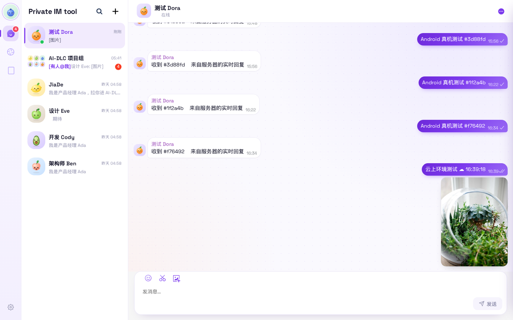

<p align="center">
  
</p>

<h1 align="center">Private IM tool</h1>

<p align="center">私密、轻快、即时。只和重要的人说话。</p>

---

Private IM tool 是一款私密即时通讯产品，有 Web 端和 Android 端（iOS 在规划中）。它支持单聊、群聊、图片 / 语音 / 文件消息，以及自研的朋友圈。服务部署在 AWS 上，文件全部存在私有对象存储中，并且正在按计划演进为全 Serverless 架构。

| Web | Android |
|---|---|
|  |   |
|  |   |

## 功能

- **消息**：单聊、群聊；文字、表情、图片、语音、文件、名片；引用回复、撤回、已读
- **朋友圈**：图文动态（最多 9 张）、点赞、评论与回复、互动消息、新动态实时红点、仅自己可见
- **联系人**：好友申请、黑名单、群组、扫码加好友
- **多端**：Web 与 Android 实时同步
- **安全**：文件存放在私有 S3（阻止公有访问、默认加密），由服务端签发短期签名链接；客户端全程 HTTPS，并严格校验证书

## 代码结构

| 目录 | 内容 | 技术栈 |
|---|---|---|
| [`server/`](server/README.md) | 业务服务：账号、好友、群组、文件、朋友圈等接口 | Go 1.20+，gin，MySQL，Valkey，S3 |
| [`web/`](web/README.md) | Web 端 | React 17，TypeScript，Semi UI |
| [`android/`](android/README.md) | Android 端 | Java / Kotlin，AGP 8.13 |
| [`infra/`](infra/README.md) | AWS 基础设施（CDK）与发布脚本 | TypeScript，AWS CDK v2 |
| [`devenv/`](devenv/README.md) | 开发环境：Docker Compose、配置、演示数据 | Docker，Python |
| [`tools/`](docs/testing.md) | 端到端测试、真机测试 | Playwright，Appium，AWS Device Farm |
| `brand/` | 品牌素材生成：应用图标、默认头像、主题色重着色 | Node.js，sharp |
| [`docs/`](docs/) | 架构、开发、部署、测试、接口文档 | |

## 快速开始

```bash
# 1. 启动依赖（MySQL、IM 网关）
cd devenv && docker compose up -d

# 2. 编译并运行业务服务
./run-server.sh

# 3. 生成演示数据（AI-DLC 项目组：5 位成员、群聊、聊天记录、朋友圈）
python3 -I seed/seed_aidlc.py && python3 -I seed/seed_moments.py

# 4. 构建并发布 Web 到云上开发环境
../infra/scripts/deploy-web.sh
```

完整步骤见 [开发指南](docs/development.md)。

## 文档

| 文档 | 内容 |
|---|---|
| [架构设计](docs/architecture/README.md) | 系统组成、关键流程、当前部署、安全设计、全 Serverless 目标架构与演进路线 |
| [开发指南](docs/development.md) | 本地与云上开发环境、配置项、演示账号、常见问题 |
| [部署](docs/deployment.md) | AWS 资源、CDK 栈、发布 Web 与 Android 安装包、回滚 |
| [测试](docs/testing.md) | 接口测试、Web 端到端测试、Android 真机测试 |
| [朋友圈接口](docs/moments-api.md) | 接口、数据结构、可见性规则、实时提醒 |
| [Demo 指南](docs/demo-guide.md) | 演示路线、产品特点、技术难点、最值得展示的动效与细节 |
| [交接说明](docs/handover.md) | 留给后续修复的安全、合规、上架事项及现状 |
| [工时与工具](docs/effort-and-tools.md) | 工时统计口径、使用的 AI 工具与服务、主要产出 |

## 许可与第三方组件

本项目使用并修改了多个开源组件，具体见各目录下的 `THIRD_PARTY_NOTICES.md` 与 `LICENSE`。
