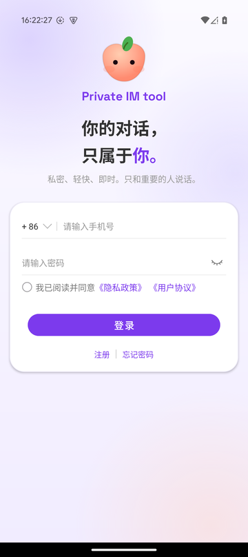
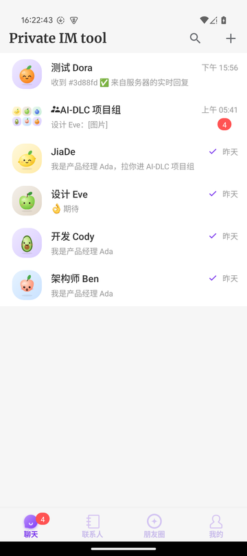
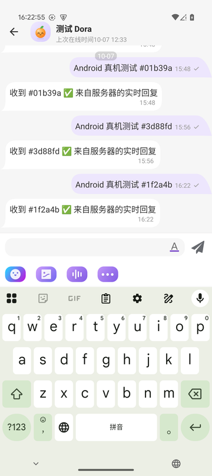
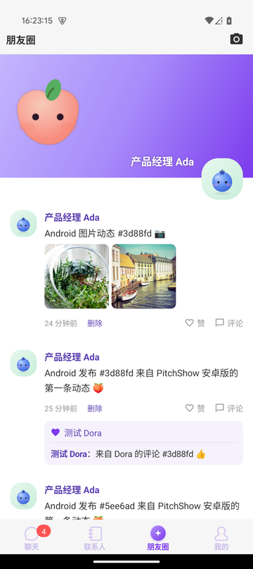

# Private IM tool · Android 端

Private IM tool 的 Android 客户端：聊天、联系人、朋友圈、个人设置。

<p>




</p>

- Java / Kotlin，Gradle 8.13，AGP 8.13，JDK 17
- compileSdk 35，targetSdk 34，minSdk 24
- 包名 `ai.pitchshow.im`

## 模块

| 模块 | 内容 |
|---|---|
| `app` | 应用入口（`TSApplication`、启动页、协议弹窗），接口地址与开发环境访问密码配置 |
| `wkbase` | 基础库：网络（Retrofit / OkHttp）、图片（Glide）、选图、看大图、通用控件、主题色与字体 |
| `wkuikit` | 聊天、会话列表、联系人、群组、我的；底部标签页 `TabActivity` |
| `wklogin` | 登录、注册、找回密码 |
| `wkscan` | 扫码 |
| `wkmoments` | **朋友圈**：时间线、发布（最多 9 张图）、点赞评论、互动消息、某人的动态、详情 |
| `wkpush` | 离线推送（华为 / 小米 / OPPO / vivo / FCM），**暂未引入**，接入自己的推送通道后再启用 |

模块之间通过 `EndpointManager` 解耦调用。例如 `wkmoments` 注册 `get_moments_fragment` 提供朋友圈标签页，`TabActivity` 注册 `tab_moments_dot` 接收红点数量。

## 构建

```bash
cat > local.properties <<EOT
sdk.dir=$HOME/.local/android-sdk
applicationId=ai.pitchshow.im
EOT
./gradlew assembleDebug            # app/build/outputs/apk/debug/app-debug.apk
```

- 默认接口地址：`app/build.gradle` → `buildConfigField API_BASE_URL`（代码会自动加上 `/v1/`）。
- 开发环境访问密码：`buildConfigField ACCESS_PASSWORD`。`AccessAuthInterceptor` 只对接口域名附加，跳转到 S3 签名地址时不会带上。
- 长连接：SDK 使用 TCP，地址由服务端 `GET /v1/users/{uid}/im` 返回的 `tcp_addr` 决定。

发布调试包：`~/tsdd/infra/scripts/publish-apk.sh`。

## 开发约定

- **颜色**：主色在 `wkbase/src/main/res/values/color.xml`（`colorAccent`）和 `Theme.colorAccount`。位图图标需要整体换色时，用 `brand/android/recolor.js`。
- **网络**：所有 HTTP 客户端都使用系统默认的证书校验，不要再加「信任所有证书」的实现。
- **标签页 Fragment**：基类 `WKBaseFragment` 的 `isShowBackLayout()` 不生效，需要隐藏返回键时自己处理；标题栏右侧按钮建议直接给图标绑定点击事件。
- **权限**：只申请实际用到的权限，新增权限前先确认 Google Play 的政策。

## 测试

真机自动化测试（AWS Device Farm）见 [测试文档](../docs/testing.md)。

## 许可

基于 Apache-2.0 许可的开源项目修改而来，见 [`LICENSE`](LICENSE) 与 [`THIRD_PARTY_NOTICES.md`](THIRD_PARTY_NOTICES.md)。
