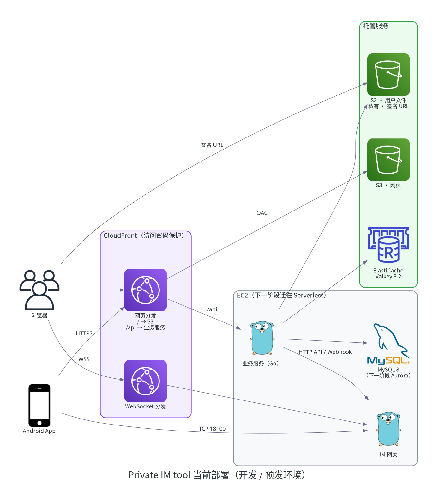
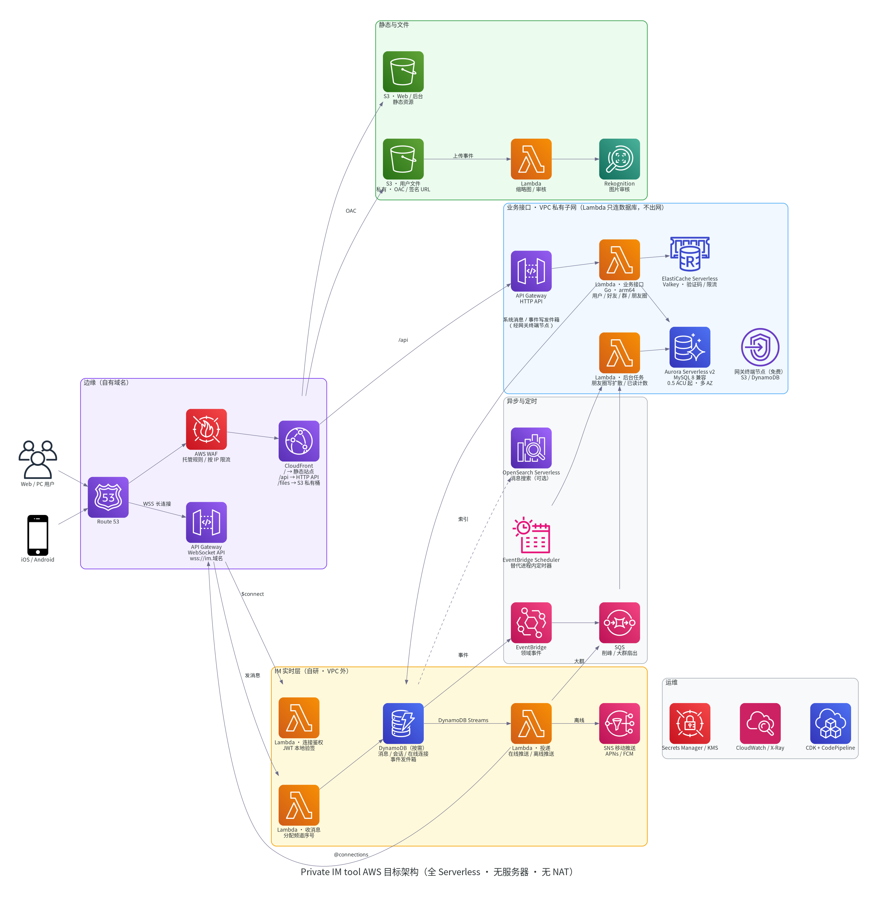

# Private IM tool 架构设计

> 版本 v3（2026-10-07）　适用范围：Private IM tool 服务端、Web 端、Android 端，以及 AWS 上的开发 / 预发环境
> 价格为 AWS 价目表 API 返回的 **ap-east-1（香港）按需价**（2026-10-07 查询）。

---

## 1. 概述

Private IM tool 是一款私密、轻快的即时通讯产品，支持 Web 和 Android，iOS 在规划中。

| 能力 | 说明 |
|---|---|
| 消息 | 单聊、群聊；文字、表情、图片、语音、文件、名片；引用回复、撤回、已读 |
| 朋友圈 | 图文动态（最多 9 张图）、点赞、评论与回复、互动消息、新动态红点，支持「仅自己可见」 |
| 联系人 | 好友申请、黑名单、群组、扫码加好友 |
| 多端 | Web 与 Android 实时同步，账号多设备登录 |

设计原则：

1. **数据私有**：文件存在私有对象存储里，不能直接公开访问，由服务端签发短期签名 URL。
2. **托管优先**：能用托管服务的地方都用托管服务（S3、ElastiCache、CloudFront，下一步是 Aurora），尽量少维护服务器。
3. **渐进演进**：从「单台 EC2 + 托管存储」出发，分阶段迁移到全 Serverless（见第 7、8 节），每一步都可以回滚。

---

## 2. 系统组成

```
┌──────────── 客户端 ────────────┐
│ Web（React）   Android（Java）  │
└──────┬───────────────┬─────────┘
       │ HTTPS /api/v1 │ 长连接（WSS / TCP）
┌──────▼──────┐  ┌─────▼──────┐
│  业务服务    │◀─▶│  IM 网关    │   业务服务调用 IM 网关 HTTP API 下发消息 / 命令；
│  （Go）      │  │            │   IM 网关通过 Webhook / Datasource 回调业务服务
└──┬───┬───┬──┘  └─────┬──────┘
   │   │   │           │
 MySQL Valkey S3     消息存储（本地 Pebble + Raft）
```

| 组件 | 职责 | 技术 |
|---|---|---|
| Web 端 | 浏览器客户端 | React 17 + TypeScript，Yarn workspaces + Turbo，Semi UI |
| Android 端 | 手机客户端 | Java / Kotlin，AGP 8.13，minSdk 24 / targetSdk 34 |
| 业务服务 | 账号、好友、群组、文件、朋友圈等 REST 接口；事件与定时任务 | Go 1.20+，gin，dbr，viper（环境变量前缀 `TS_`） |
| IM 网关 | 长连接接入（TCP / WebSocket）、消息路由、离线消息、会话与未读 | 基于开源 WuKongIM v2（Apache-2.0） |
| 业务数据库 | 用户、好友、群、朋友圈等 | MySQL 8（下一阶段 Aurora Serverless v2） |
| 缓存 | 登录令牌、验证码、限流、计数 | ElastiCache Valkey 8.2 |
| 对象存储 | 聊天图片 / 语音 / 文件、朋友圈图片、头像 | S3 私有桶，按类型分前缀 |
| 边缘 | 网页分发、`/api` 与 WebSocket 回源 | CloudFront（OAC） |

模块化方式：业务服务按模块注册（`register.AddModule`），每个模块自带路由、数据表迁移脚本和事件监听；Web 和 Android 都按功能拆成独立的包或模块（如朋友圈 `tsdaodaomoments` / `wkmoments`），通过端点注册接入主框架。

---

## 3. 关键流程

### 3.1 登录与建立长连接

1. 客户端 `POST /v1/user/login`，拿到 `token`（后续请求放在 `token` 请求头里）和 IM 令牌。
2. 客户端 `GET /v1/users/{uid}/im` 获取长连接地址：Web 用 `wss_addr`，App 用 `tcp_addr`。
3. 客户端连接 IM 网关；网关回调业务服务校验令牌，连接建立后同步会话和离线消息。

### 3.2 发送消息

客户端通过长连接把消息发给 IM 网关 → 网关分配频道内序号并持久化 → 推送给在线的接收方，离线的接收方下次上线时同步 → 业务服务通过 Webhook 获知消息（用于搜索、通知等）。

### 3.3 发送图片 / 文件

1. 客户端 `GET /v1/file/upload?type=chat&path=/{频道类型}/{频道ID}/{文件名}` 获取上传地址。
2. 客户端把文件上传给业务服务，业务服务写入 S3，返回相对路径（如 `file/preview/chat/...`）。
3. 消息里只携带相对路径。展示时访问 `/v1/file/preview/...`，业务服务 302 跳转到 **1 小时有效的 S3 签名 URL**。

### 3.4 朋友圈

- **写扩散**：发布时把动态写入每个可见好友的时间线表（`moment_feed`），读取时间线就是单表分页，不随好友数量变慢。
- **可见性**：读取时再次校验好友关系和黑名单。「仅自己可见」的动态不扩散。评论和点赞只对**双方都是好友**的人可见（共同好友规则）。
- **实时提醒**：有人发布、点赞、评论时，业务服务通过 IM 网关给相关用户下发 `momentMsg` 命令消息，客户端收到后刷新红点。
- **图片**：上传类型 `moment`，路径固定在发布者自己的 `uid` 目录下。

接口说明见 [朋友圈接口](../moments-api.md)。

---

## 4. 当前部署（开发 / 预发环境）



| 资源 | 规格 | 说明 | 月费 |
|---|---|---|---|
| EC2 | t3.xlarge | 运行业务服务、IM 网关、MySQL（Docker Compose） | 共用现有实例 |
| ElastiCache | Valkey 8.2，`cache.t4g.micro`，单节点 | 静态加密，每日快照；只允许 EC2 访问 | ≈ $15.8 |
| S3 · 网页 | 私有桶 | 只允许 CloudFront 通过 OAC 读取 | ≈ $0 |
| S3 · 用户文件 | 私有桶，版本控制（旧版本保留 30 天） | 实例角色凭证访问；签名 URL 下载 | 按量 |
| CloudFront | 网页分发、WebSocket 分发 | 网页和 `/api` 有访问密码；`/api/*` 去掉前缀后回源业务服务 | ≈ $1 |
| 安全组 | `pitchshow-dev-origin`、`pitchshow-dev-cache` | 回源端口只放行 CloudFront；缓存只放行 EC2 | 免费 |

接入方式：

| 入口 | 地址 | 说明 |
|---|---|---|
| 网页与接口 | `https://<网页分发>/`、`/api/v1/` | 访问密码保护（开发环境） |
| Web 长连接 | `wss://<WebSocket 分发>` | 浏览器跨域不会带上 Basic Auth，所以不设访问密码；连接本身需要 IM 令牌 |
| App 长连接 | `TCP <EC2 公网 IP>:18100` | App 的 SDK 只支持 TCP，CloudFront 无法代理 TCP，只能直连 |
| App 安装包 | `https://<网页分发>/download/private-im-dev.apk` | 调试包 |

基础设施代码（AWS CDK）见 [部署文档](../deployment.md)。

---

## 5. 安全设计

| 方面 | 措施 |
|---|---|
| 传输 | 客户端到 CloudFront 全程 HTTPS / WSS；Android 端使用系统默认证书校验，WebView 遇到证书错误时拒绝连接 |
| 文件 | S3 全部私有、阻止公有访问、默认加密；下载使用业务服务签发的 1 小时签名 URL |
| 凭证 | 服务端用 EC2 实例角色访问 S3，代码和配置里没有任何 AWS 密钥 |
| 网络 | 回源端口只对 CloudFront 前缀列表开放；缓存只允许 EC2 安全组访问 |
| 权限 | CDK 部署角色只有 PowerUser 加上本项目前缀的 IAM 权限，不是 Administrator |
| 开发环境 | 整站加访问密码，防止测试账号外泄后被人随意登录 |

**已知事项（上线前需要处理）**

1. 开发环境配置了固定短信验证码，正式环境要接入短信服务商并清空这项配置。
2. App 长连接端口 18100 对公网开放：连接需要 IM 令牌，消息体由 SDK 做 DH 密钥协商 + AES 加密，但传输层没有 TLS。目标架构改为 WSS 统一接入（见第 7 节）。
3. CloudFront 回源到 EC2 用的是 HTTP，迁移到 API Gateway / Lambda 后自然解决。
4. EC2 公网 IP 不是弹性 IP，实例重启后会变，App 长连接地址要跟着更新。
5. 文件预览接口 `/v1/file/preview/...` 不校验登录，知道路径即可换取签名 URL；另有密码哈希、日志脱敏、CORS、合规与上架等待改进项，完整清单见 [交接说明](../handover.md)。

---

## 6. 代码与环境

| 目录 | 内容 |
|---|---|
| `server/` | 业务服务（Go） |
| `web/` | Web 端 |
| `android/` | Android 端 |
| `infra/` | AWS CDK 基础设施代码与发布脚本 |
| `devenv/` | 开发环境（Docker Compose、配置、演示数据脚本） |
| `tools/` | 端到端测试（Playwright）、真机测试（AWS Device Farm） |
| `brand/` | 品牌素材生成脚本（图标、头像、主题色） |
| `docs/` | 本文档及开发、部署、测试文档 |

---

## 7. 目标架构：全 Serverless



目标是**没有 EC2、没有负载均衡、没有 NAT**。关键在于 IM 网关：它是有状态的长连接服务（本地存储 + Raft 选主），放不进 Lambda 或 Fargate。因此目标架构用 **API Gateway WebSocket + Lambda + DynamoDB 自研 IM 层**取代它，同时统一采用 JSON over WSS 协议，App 也不再走 TCP。

| 组件 | 目标 | 改动 |
|---|---|---|
| 网页 | S3 + CloudFront | ✅ 已完成 |
| 用户文件 | S3 私有桶 + 签名 URL | ✅ 已完成 |
| 缓存 | ElastiCache → ElastiCache Serverless（Valkey） | 开启 TLS；`KEYS` 改为 `SCAN` |
| 业务数据库 | Aurora Serverless v2（MySQL 8 兼容），最低 0.5 ACU 常驻 | 只改连接串 |
| 业务接口 | API Gateway HTTP API + Lambda（Go，arm64） | 先用 Lambda Web Adapter 原样运行，再逐步拆分函数 |
| 后台任务 | EventBridge Scheduler / SQS → Lambda | 已读计数、事件重试、朋友圈写扩散改为消息驱动，天然只执行一次 |
| 长连接 | API Gateway WebSocket API | 自研轻量协议；JWT 在 `$connect` 时本地验签 |
| 消息存储 | DynamoDB 按需：消息（频道 + 序号）、会话、在线连接、事件发件箱 | 用条件更新分配频道序号，保证单频道内有序 |
| 消息投递 | DynamoDB Streams → 投递 Lambda → `@connections`；离线走 SNS 移动推送 | 大群先进 SQS，再分批扇出 |
| 图片审核 | S3 事件 → Lambda → Rekognition | 新增 |
| 消息搜索 | 一期用 Aurora ngram 全文索引，量大后换 OpenSearch Serverless | 由 Streams 同步索引 |

**不用 NAT 网关**：只有需要连数据库的 Lambda 放在 VPC 里，它们只访问 Aurora、Valkey，以及通过免费的网关终端节点访问 S3 / DynamoDB。需要往外发的事件统一写进 DynamoDB 发件箱，再由 VPC 外的 Lambda 处理；Aurora 和 Valkey 都用 IAM 鉴权，令牌在本地签名生成，不需要出网。

**API Gateway WebSocket 的限制及应对**（上线前需在 ap-east-1 复核配额）

| 限制 | 应对 |
|---|---|
| 单个连接最长 2 小时，空闲 10 分钟断开 | 每 5 分钟发一次心跳；断线自动重连，重连后按序号补拉 |
| 单条消息 128 KB | 图片、语音、文件只传 S3 路径（和现在一样） |
| 推送需要按连接逐个调用 | 群聊扇出走 SQS 批处理，并控制并发 |

**成本估算**（按 1,000 日活、人均每天在线 8 小时、每天发 100 条、每条平均投递给 5 个人）

| 部分 | 内容 | 月费 |
|---|---|---|
| 固定 | Aurora 0.5 ACU + 10 GB（$81.5）、Valkey Serverless 最低档（≈ $8）、WAF / Route 53 / Secrets / CloudWatch（≈ $25） | ≈ $115 |
| 按量 | WebSocket 消息和连接时长（$31）、HTTP API（$7）、Lambda（$16）、DynamoDB（$22）、推送 / 事件 / 队列（≈ $5）、S3（$1.3） | ≈ $80 |
| **合计** | | **≈ $195/月**，没有用户时约 $115 |

按量部分大致随日活线性增长，约每个日活每月 $0.08。日活到数万以上时，WebSocket 消息费会成为大头，届时可以只把网关层换成自建的长连接服务，其他部分不用动。

---

## 8. 演进路线

| 阶段 | 内容 | 状态 |
|---|---|---|
| P1 | 文件 → S3；网页 → S3 + CloudFront；缓存 → ElastiCache | ✅ 2026-10-07 完成 |
| P2 | MySQL → Aurora Serverless v2 | 待开始 |
| P3 | 业务接口 → Lambda；JWT 鉴权；后台任务改为消息驱动 | 待开始 |
| P4 | 自研 IM 层（API Gateway WebSocket + DynamoDB），新旧并行一段时间，迁移历史消息后再切换 | 待开始 |
| P5 | 下线 EC2 与现有 IM 网关；客户端统一使用新 SDK | 待开始 |

每个阶段都先在开发环境演练，确认可以回滚后再推进。

**客户端改造量**（P4 需要）：Web 和 Android 都要替换现有 IM SDK。消息、会话、频道这些数据层几乎遍布界面代码，预计各需 2～3 周。

---

## 9. 待验证事项

1. API Gateway WebSocket 在 ap-east-1 的配额：连接时长、新建连接速率、`@connections` 调用速率
2. 0.5 ACU Aurora 的最大连接数与 Lambda 并发上限怎么配比；RDS Proxy 的价格
3. ElastiCache Serverless 与现有 Redis 客户端（TLS、`SCAN`）的兼容性
4. 历史消息迁移：按频道导出 → DynamoDB，校验序号连续、已读状态一致
5. 时间处理：数据库时区与进程时区不同，所有时间比较统一用数据库函数（`UNIX_TIMESTAMP()`、`NOW()`）

---

### 附：架构图

`~/tsdd/tools/venv/bin/python draw_architecture.py` 生成 `phase1.png`（当前部署）和 `target.png`（目标架构），使用开源库 [diagrams](https://github.com/mingrammer/diagrams)（MIT）和 AWS 官方架构图标。
