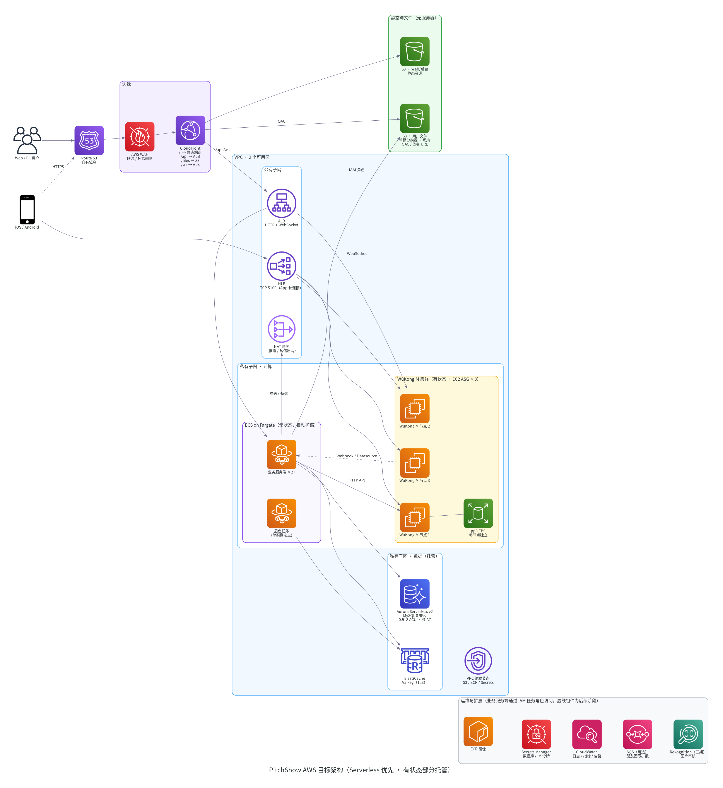

# PitchShow AWS 交付架构方案

> 版本：v1（2026-10-06）　范围：基于唐僧叨叨（TangSengDaoDao）+ WuKongIM 的 PitchShow IM
> 现状数据来自对 `/opt/tsdd` 部署、源码与 AWS 账号配置（只读）的实际核查；价格为 AWS 价目表 API 返回的 **ap-east-1（香港）按需价**。
> 演示环节**不做改造**，本文档作为交付改造的方案依据。

---

## 1. 结论摘要

| 问题 | 结论 |
|---|---|
| MinIO 是什么，存储桶是谁定义的？ | MinIO 是**自建的、兼容 S3 协议的对象存储**，跑在 EC2 的 Docker 里。存储桶由唐僧叨叨代码**按文件类型自动创建**（上传路径第一段即桶名：`chat`、`moment`、`avatar`…），创建时设置了**匿名可列举、可读、可写、可删除**的桶策略。 |
| 为什么不用 S3？ | 唐僧叨叨主打私有化部署（含国内机房、无云依赖），所以默认 MinIO。部署在 AWS 上时 **S3 明显更合适**（11 个 9 持久性、无需管磁盘、生命周期策略、CloudFront OAC 私有访问）。现有 MinIO 驱动不能直接指向 S3：桶名全局冲突、匿名桶策略会被 S3「阻止公有访问」拒绝。需新增一个约 1–2 天工作量的 S3 存储实现。 |
| 用了哪些数据库？ | ① **MySQL 8**：业务数据（用户、好友、群、朋友圈…）；② **Redis 7**：缓存、登录令牌、验证码、限流、已读计数；③ **WuKongIM 内置存储**（Pebble + Raft）：**聊天消息本身存在这里，不在 MySQL**；④ **MinIO**：图片与文件。代码里还有可选的 Elasticsearch 消息搜索，当前未启用。 |
| 能不能改成 Serverless？ | **能改大部分，但不是全部。** 静态站点、文件、数据库、缓存、业务服务端都可以用 Serverless 或全托管服务（S3、Aurora Serverless v2、ElastiCache Serverless、ECS Fargate）。**WuKongIM 长连接网关是有状态的**（长连接 + 本地存储 + Raft 集群），不适合 Lambda/Fargate，应放在 EC2 Auto Scaling 组上，用独立 EBS。业务服务端有常驻后台任务和 gRPC Webhook 服务，适合 Fargate，不适合 Lambda。 |
| 需要立即处理的事 | **线上文件服务存在高危漏洞**（见第 3 节）：任何人无需登录即可列出、下载、覆盖、删除聊天图片。修复不依赖架构改造，建议立即执行。 |

---

## 2. 现状架构（已核实）

| 项 | 现状 | 问题 |
|---|---|---|
| 计算 | 单台 EC2 `t3.xlarge`（x86），`ap-east-1a`，默认 VPC，Docker Compose 跑 7 个容器 | 单可用区、单点；实例故障即全站不可用 |
| 入口 | 3 个 CloudFront 分发：网页+API（:8082）、WebSocket（:8083）、文件（:8084）；`CachingDisabled`；**回源 HTTP**；无 WAF | CDN 到源站明文；无限流和防护 |
| 安全组 | 仅放行 8082–8084，来源限定 CloudFront 前缀列表 `pl-14b2577d` | ✅ 正确。但 App 用的 TCP 5100 未开放，手机端目前无法直连 |
| 数据 | MySQL、Redis、MinIO、WuKongIM 数据全部在同一块 50GB gp3 EBS 上 | 无自动备份/时间点恢复；磁盘满或损坏会同时影响全部数据 |
| 文件 | MinIO 匿名读写桶策略 + 文件分发允许全部 HTTP 方法 | **高危**，见第 3 节 |
| 短信 | 未配置服务商；设置了固定验证码 | **高危**：任何人可用固定码重置任意账号密码 |
| 月成本 | EC2 $170.5 + EBS $5.3 ≈ **$176/月**（不含 CloudFront 流量） | |

---

## 3. 立即需要修复的安全问题（P0，与改造无关）

| # | 问题 | 证据 | 修复 | 影响 |
|---|---|---|---|---|
| 1 | 文件桶匿名可列举 | 对 `https://dexample2.cloudfront.net/chat/?list-type=2` 匿名请求返回 200，含真实用户私聊图片路径 | MinIO 桶策略改为**仅匿名 `s3:GetObject`**，去掉 List/Put/Delete | 无。客户端只按完整路径取图 |
| 2 | 文件可被匿名覆盖/删除 | 桶策略含匿名 `PutObject`/`DeleteObject`；文件分发 `EEXAMPLEDIST3` 允许 PUT/DELETE/POST/PATCH（未做写入测试） | 分发改为只允许 `GET, HEAD` | 无。上传走 `/api` 由服务端代传 |
| 3 | 固定短信验证码 | `/opt/tsdd/.env` 中 `TS_SMSCODE` 有值 | 接入阿里云短信后清空；在此之前关闭注册或改为邀请码注册 | 接入前新用户无法自助注册 |
| 4 | CDN 回源明文 | 三个分发 `OriginProtocolPolicy=http-only` | 源站加 TLS（或迁移到 ALB 后用 HTTPS 回源） | 无 |

> 第 1、2 项各需要一条命令，可在 5 分钟内完成。执行前会再次确认。

---

## 4. 组件逐项评估：哪些适合 Serverless

| 组件 | 当前 | 目标 | 是否 Serverless | 理由 / 代码改动 |
|---|---|---|---|---|
| Web 前端、后台管理 | nginx 容器 | **S3 + CloudFront** | ✅ 完全 | 纯静态 SPA，API 已是相对路径 `/api/v1/`，无需改代码 |
| 用户文件 | MinIO | **S3 私有桶 + CloudFront OAC** | ✅ 完全 | 新增 S3 存储实现：单桶、按类型分前缀、不设公有策略、用 IAM 角色凭证。私聊图片后续可改为 CloudFront 签名 URL |
| 业务数据库 | MySQL 8 容器 | **Aurora Serverless v2（MySQL 8 兼容）** | ✅ 按 ACU 弹性 | 协议兼容，改连接串即可；多可用区、自动备份、时间点恢复 |
| 缓存 | Redis 7 容器 | **ElastiCache Serverless（Valkey）**，或节点型 Valkey | ✅ / ⚠️ | Serverless 强制 TLS，需在 Redis 客户端开启 TLS（go-redis v6 支持）。**已读计数任务使用 `KEYS` 前缀扫描**，需改为 `SCAN` 或待处理集合；对集群模式的兼容性需验证，不通过则退回节点型 |
| 业务服务端（Go） | 单容器 | **ECS on Fargate**，≥2 个任务，跨 AZ | ✅ Serverless 容器 | 基本无状态，但：① 每 3 秒的已读计数任务多副本会重复执行，需 Redis 锁选主或拆成单实例后台服务；② 日志写本地文件，改为 stdout → CloudWatch；③ 需同时暴露 HTTP（ALB）和给 WuKongIM 的 gRPC Webhook（内网） |
| 业务服务端改 Lambda？ | — | 不建议 | ❌ | 常驻 goroutine（事件池、定时任务、朋友圈写扩散）、gRPC 服务端、进程内锁，都不符合 Lambda 的请求-响应模型，重写成本高、收益低 |
| WuKongIM（IM 网关） | 单容器 | **EC2 Auto Scaling 组 ×3**（Graviton），每节点独立 gp3 EBS，Raft 集群 | ❌ 有状态 | 长连接（TCP 5100 / WS 5200）+ 本地 Pebble 存储 + Raft 选主。Fargate 任务重启会丢本地数据，Lambda/API Gateway WebSocket 需要重写协议和全部客户端 SDK |
| App 长连接入口 | 未开放 | **NLB TCP 5100** | — | WebSocket 走 CloudFront → ALB |
| 朋友圈写扩散 | 进程内 goroutine | 可选 **SQS** 异步队列 | ✅ | 好友多、发布量大时再改，一期不必 |
| 图片审核 | 无 | **S3 事件 → Lambda → Rekognition** | ✅ | 三期内容审核。中文文本审核建议用阿里云内容安全 |
| 短信 | 未接入 | **阿里云短信**（已有驱动） | — | AWS 短信发中国大陆号码受限，继续用阿里云 |
| 推送 | — | APNs / FCM / 华为、小米、OPPO、vivo 厂商通道（已有驱动） | — | FCM 在中国大陆不可用，安卓需厂商通道 |

---

## 5. 目标架构

**请求路径**
- **网页**：Route 53 → WAF → CloudFront，`/` 指向 S3 静态站点，`/api/*` 和 `/ws` 指向 ALB，`/files/*` 通过 OAC 访问 S3 私有桶
- **App**：HTTPS 接口同上；IM 长连接走 NLB TCP 5100，直达 WuKongIM 集群
- **服务间**：业务服务端调用 WuKongIM HTTP API（内网）；WuKongIM 通过内网 NLB / Cloud Map 地址回调业务服务端的 gRPC Webhook 和 Datasource

**网络**：2 个可用区；ALB、NLB、NAT 在公有子网；计算与数据在私有子网。S3 用网关终端节点（免费）。小规模阶段不建接口终端节点，ECR、Secrets、Logs 走 NAT 出网，4 个接口终端节点 × 2 AZ 约 $84/月。

**安全**：WAF 托管规则加按 IP 限流；所有凭证放 Secrets Manager，以 ECS secrets 注入；任务角色最小权限（只能访问本项目 S3 前缀）；数据库和缓存仅允许来自计算安全组；S3 全部私有。

---

## 6. 成本估算（ap-east-1 按需价，730 小时/月）

| 资源 | 规格 | 单价 | 月费 |
|---|---|---|---|
| 业务服务端 | Fargate ARM 2 任务 × 0.5 vCPU / 1 GB | vCPU $0.04449/h，GB $0.00487/h | $39.6 |
| 后台任务 | Fargate ARM 1 任务 × 0.25 vCPU / 0.5 GB | 同上 | $9.9 |
| WuKongIM | 3 × t4g.medium + 3 × 30 GB gp3 | $0.0464/h，gp3 $0.1056/GB·月 | $111.1 |
| Aurora Serverless v2 | 最低 0.5 ACU（常驻）+ 10 GB | $0.22/ACU·h，$0.12/GB·月 | $81.5 起（平均 1 ACU 时约 $162） |
| ElastiCache Serverless Valkey | 最低 100 MB 数据 + 少量 ECPU | $0.111/GB·h，$0.0031/百万 ECPU | ≈ $9 |
| ALB | 1 个 + 约 1 LCU | $0.0277/h + $0.0088/LCU·h | $26.6 |
| NLB | 1 个 + 少量 LCU | $0.0277/h + $0.0066/LCU·h | ≈ $25 |
| NAT 网关 | 1 个（单 AZ） | $0.065/h + $0.065/GB | $47.5 + 流量 |
| S3 | 50 GB | $0.025/GB·月 | $1.3 |
| WAF、Secrets Manager、CloudWatch | 基础规则 / 4 个密钥 / 日志 | 参考价，未逐项核实 | ≈ $20 |
| **合计（高可用小规模）** | | | **≈ $370/月**，另加 CloudFront 与 NAT 流量 |

**低成本演示档（≈ $200/月）**：WuKongIM 单节点 c7g.large（$66.4），Aurora 最低 0.5 ACU，Fargate 1 个任务，NAT 换成 Fargate 公网 IP 加严格安全组。代价是 IM 层仍是单点。

> 当前单机约 $176/月，但没有高可用、备份和弹性。目标架构多出的成本主要用于多可用区、托管数据库和负载均衡。Aurora 支持最低 0 ACU 自动暂停，但冷启动有十几秒延迟，**不适合 IM 生产环境**，仅适合测试环境（具体支持需在 ap-east-1 确认）。

---

## 7. 需要的代码改动

| # | 改动 | 位置 | 工作量 |
|---|---|---|---|
| 1 | ✅ **已完成（开发环境已切换，2026-10-07）** S3 文件存储：单桶 + 类型前缀、IAM 角色凭证、无公有策略、签名 URL / 可选 CloudFront 地址 | `modules/file/service_s3.go`，`TS_FILESERVICE=s3` + `TS_S3_*` | — |
| 2 | Redis：可选 TLS；已读计数 `KEYS` → `SCAN` / 待处理集合；定时任务用 Redis 锁保证单实例执行 | `pkg/redis`、`modules/message/event.go` | 1 天 |
| 3 | 日志输出到 stdout（JSON）；优雅退出；健康检查（已有 `/v1/ping`） | `main.go`、日志配置 | 0.5 天 |
| 4 | 时间统一用数据库 `UNIX_TIMESTAMP()` 或固定会话时区（朋友圈模块已处理，其余模块需排查） | 各模块 | 0.5–1 天 |
| 5 | WuKongIM 集群配置；Webhook / Datasource 地址改为内网服务发现地址 | WuKongIM 配置、`server.env` | 1–2 天（含验证） |
| 6 | Web / 后台管理构建产物发布到 S3，CloudFront 路由 | CI 脚本 | 0.5 天 |
| 7 | 基础设施代码（AWS CDK）：VPC、ALB/NLB、ECS、ASG、Aurora、ElastiCache、S3、CloudFront、WAF | 新仓库 `pitchshow-infra` | 3–5 天 |
| 8 | （可选）朋友圈写扩散改用 SQS | `modules/moment` | 1 天 |

---

## 8. 分阶段迁移路线

| 阶段 | 内容 | 风险 / 回滚 |
|---|---|---|
| **P0 立即** | 第 3 节安全修复 | 极低；改回原配置即可回滚 |
| **P1 存储托管** | MySQL → Aurora；MinIO → S3；Redis → ElastiCache。计算仍在现有 EC2 | 中。MySQL 用 `mysqldump` 或 DMS；文件用 `mc mirror` 同步到 S3。数据库存的是 `chat/…` 这类相对路径，**迁移后 URL 不变**。可随时切回原容器 |
| **P2 计算无服务器化** | 业务服务端 → ECS Fargate；Web/后台 → S3；ALB 接入 CloudFront | 低。CloudFront 改源即可切换和回滚 |
| **P3 IM 集群化** | WuKongIM → 3 节点 ASG + NLB；开放 App 长连接 | **最高**。聊天消息在 WuKongIM 存储里，需按官方集群迁移流程演练，先在开发环境完整验证 |
| **P4 扩展** | WAF 规则细化、SQS 写扩散、Rekognition 审核、告警和看板 | 低 |

每个阶段都先在开发环境（`~/tsdd/devenv`）演练，再切线上。

---

## 9. 区域与合规

- **当前区域 ap-east-1（香港）**：对中国大陆用户延迟较低，无需 ICP 备案。适合演示、海外和港澳台用户。
- **若主要面向中国大陆并正式运营**：需要 AWS 中国区（北京 / 宁夏，独立账号，由光环新网 / 西云数据运营），自有域名 ICP 备案，即时通讯与 UGC 相关资质，内容审核、实名、日志留存等合规要求。架构不变，服务可用性和价格需按中国区重新核对。
- 短信用阿里云；安卓推送接国内厂商通道。

---

## 10. 待验证事项

1. ElastiCache Serverless 与 go-redis v6、`KEYS` 命令的兼容性（不通过则用节点型 Valkey，例如 `cache.t4g.small`）
2. WuKongIM v2 从单机迁移到 3 节点集群的数据迁移流程
3. Aurora Serverless v2 在 ap-east-1 的最低 ACU 与自动暂停支持情况
4. WAF、CloudFront 流量费用按实际流量复核
5. 其余模块在「库为北京时间、进程为 UTC」时是否存在时间偏移。**已发现并修复一处**：事件重试（`modules/base/event/db.go`）用进程时间比较，导致失败事件要 8 小时后才重试，线上同样受影响
7. **消息全文搜索**：WuKongIM 的消息搜索需要搜索插件，开发与线上都未安装（`plugin not found`）。已改为降级只返回好友/群聊结果；要支持搜聊天内容，需安装官方搜索插件，或自建 OpenSearch 索引（可用 `message.update.search.data` 事件同步）
6. 事件重试定时任务（`main.go` 每 59 秒）在多副本部署时会在每个副本上重复执行，需与已读计数任务一起做单实例选主

---

### 附：图的生成方式
`~/tsdd/tools/venv/bin/python draw_architecture.py` 生成 `current.png` 和 `target.png`。依赖开源库 [diagrams](https://github.com/mingrammer/diagrams)（MIT），使用 AWS 官方架构图标。
